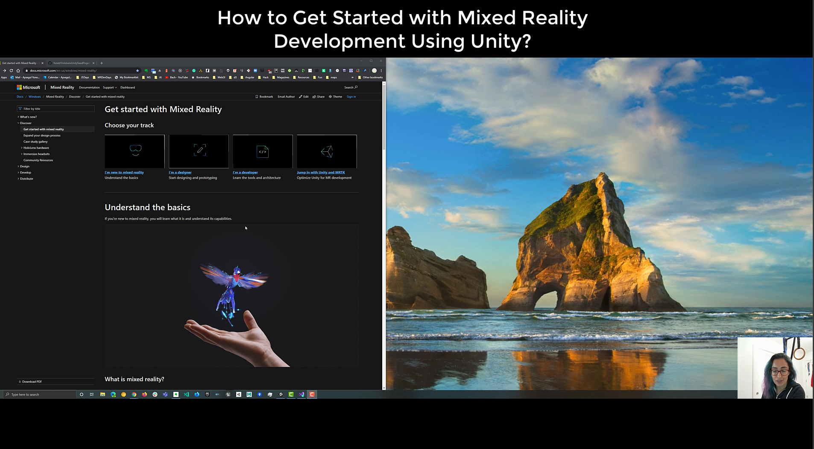

# How to Get Started with Mixed Reality Development Using Unity?

[https://youtu.be/5Ri3mhvY1\_U](https://youtu.be/5Ri3mhvY1_U)

## What is the Mixed Reality Toolkit?

The [Mixed Reality Toolkit (MRTK)](https://microsoft.github.io/MixedRealityToolkit-Unity/README.html) is a cross-platform toolkit for building Mixed Reality experiences for Virtual Reality (VR) and Augmented Reality (AR). MRTK is intended to accelerate development of applications targeting Microsoft HoloLens, Windows Mixed Reality immersive (VR) headsets and OpenVR platform. Here are some of MRTK's functions:

- Provides the basic building blocks for Unity development on HoloLens, Windows Mixed Reality, and OpenVR.
- Enables rapid prototyping via in-editor simulation that allows you to see changes immediately.
- Operates as an extensible framework that provides developers the ability to swap out core components.
- Supports a wide range of platforms, including
    - Microsoft HoloLens
    - Microsoft HoloLens 2
    - Windows Mixed Reality headsets
    - OpenVR headsets (HTC Vive / Oculus Rift)

## Download MRTK Unity Package(s)

MRTK provides 4 MRTK Unity packages which can be imported into your Unity project. The latest version of the packages can be found on the [MRTK Releases](https://github.com/Microsoft/MixedRealityToolkit-Unity/releases) page. The **Microsoft.MixedRealityToolkit.Unity.Foundation.unitypackage** is the only **required** package that must be downloaded, imported and configured for your Unity project to use MRTK with your project. A brief description is provided below of each MRTK Unity package. Additional information regarding each package's contents is available at [MRTK Package Contents](https://microsoft.github.io/MixedRealityToolkit-Unity/Documentation/MRTK_PackageContents.html).

**Microsoft.MixedReality.Toolkit.Unity.Foundation.2.3.0.unitypackage** (*Required*)

The Microsoft.MixedRealityToolkit.Unity.Foundation package includes the core components required to create a mixed reality application. This package is required to use all optional MRTK Unity packages.

**Microsoft.MixedReality.Toolkit.Unity.Tools.2.3.0.unitypackage** (*Optional*)

The optional Microsoft.MixedRealityToolkit.Unity.Tools package includes helpful tools that enhance the mixed reality development experience using the Microsoft Mixed Reality Toolkit. These tools are located in the **Mixed Reality Toolkit** > **Utilities** menu in the Unity Editor.

**Microsoft.MixedReality.Toolkit.Unity.Examples.2.3.0.unitypackage** (*Optional*)

The optional Microsoft.MixedRealityToolkit.Unity.Examples package includes demonstration projects that illustrate the features of the Microsoft Mixed Reality Toolkit.

**Microsoft.MixedReality.Toolkit.Unity.Extensions.2.3.0.unitypackage** (*Optional*)

The optional Microsoft.MixedRealityToolkit.Unity.Extensions package includes additional services that extend the functionality of the Microsoft Mixed Reality Toolkit.

For this lesson, download the latest version of the **Microsoft.MixedRealityToolkit.Unity.Foundation.unitypackage** package from the [MRTK Releases](https://github.com/Microsoft/MixedRealityToolkit-Unity/releases) page.

### Create a New Project in Unity

Create a new 3D Unity project via the Unity Hub. Be sure to save the project at a location as close to the root of the drive as possible to avoid build errors for your mixed reality application.

### Configure Unity Project for Windows Mixed Reality

Configuring your Unity project for Windows Mixed Reality slightly differs depending on your device. Be sure to complete all steps below as indicated for your device.

**Switch Build Platform (all devices)**

In the Unity menu, select **File** > **Build Settings...** to open the Build Settings window. In the Build Settings window, select **Universal Windows Platform** and click the **Switch Platform** button. Unity will begin the process to switch the platform.

When Unity has finished switching the platform, close the Build Settings window.

**Enable Virtual Reality (all devices)**

Enabling virtual reality applies to mixed reality and augmented reality headsets because it refers to enabling stereoscopic vision, i.e. rendering different images for each eye. In the Unity menu, select **Edit** > **Project Settings...** to open the Project Settings window.

In the Project Settings window, select **Player** > **XR Settings** to expand the XR Settings.

In the XR Settings, check the **Virtual Reality Supported** checkbox to enable virtual reality. Next, click the **+** icon and select **Windows Mixed Reality** to add the Windows Mixed Reality SDK. Unity will begin the process to add the SDK.

When Unity has finished adding the SDK, optimize the XR Settings as follows:

- Set Windows Mixed Reality **Depth Format** to **16-bit depth**
- Check the Windows Mixed Reality **Enable Depth Sharing** checkbox
- Set Stereo **Rendering Mode** to **Single Pass Instanced**.

To learn about optimizing Unity for Windows Mixed Reality, you can refer to  [Recommended settings for Unity](https://docs.microsoft.com/en-us/windows/mixed-reality/recommended-settings-for-unity).

**Enable Spatial Perception (HoloLens 2 only)**

Spatial perception allows visualization of the spatial mapping mesh on Windows Mixed Reality devices. In the Project Settings window, select **Player** > **Publishing Settings** to expand the Publishing Settings.

In the Publishing Settings, scroll down to the **Capabilities** section and check the **SpatialPerception** checkbox.

Close the Project Settings window.

**Configure Quality Settings (HoloLens - first gen only)**

Since maintaining high framerate on HoloLens (first gen) is so important, we want the quality settings tuned for fastest performance. For more detailed performance information, review [Performance recommendations for Unity](https://docs.microsoft.com/en-us/windows/mixed-reality/performance-recommendations-for-unity).

Still inside the **Project Settings** window, select **Quality**. Next, select the dropdown under the **Windows Store** logo and select **Very Low**. You'll know the setting is applied correctly when the box in the Windows Store column and the **Very Low** row is green.

Close the Project Settings window.

### Import TextMesh Pro Essential Resources

[TextMesh Pro](https://docs.unity3d.com/Manual/com.unity.textmeshpro.html) is Unity's default text component. TextMesh Pro uses advanced text rendering techniques along with a set of custom shaders; delivering substantial visual quality improvements while giving users incredible flexibility when it comes to text styling and texturing. TextMesh Pro provides control over text formatting and layout with features like character, word, line and paragraph spacing, kerning, justified text, Links, over 30 Rich Text Tags available, support for Multi Font & Sprites, Custom Styles and more.

The TextMesh Pro package also includes additional resources that will make discovering and learning about TextMesh Pro's powerful features easier. These resources are available in the TextMesh Pro Essential Resources package. The TextMesh Pro Essential Resources package is required by Mixed Reality Toolkit's UI elements.

In the Unity menu, select **Window** > **TextMeshPro** > **Import TMP Essential Resources**.

In the Import Unity Package window, click the **All** button to ensure all the assets are selected, then click the **Import** button to import the assets.

### Import MRTK Unity Package(s)

Custom packages can be imported into a Unity project via a custom package import. The **Microsoft.MixedReality.Toolkit.Unity.Foundation.2.3.0.unitypackage** package is required to use MRTK within your Unity project. To import the package into your project, select **Assets** > **Import Package** > **Custom Package** in the Unity menu.

In the **Import package...** window, select the **Microsoft.MixedReality.Toolkit.Unity.Foundation.2.2.0.unitypackage** you downloaded and click the **Open** button.

In the Import Unity Package window, click the **All** button to ensure all the assets are selected, then click the **Import** button to import the assets.

You can repeat the same steps above to import the additional optional MRTK Unity packages. For this lesson, only the **Microsoft.MixedReality.Toolkit.Unity.Foundation.2.2.0.unitypackage** is required.

### Configure Unity Project for Mixed Reality Toolkit

After the required MRTK package has been imported, the **MRTK Project Configurator** window should appear. If it does not, open it by selecting **Mixed Reality Toolkit** > **Utilities** > **Configure Unity Project** in the Unity menu.

In the MRTK Project Configurator window, expand the **Modify Configurations** section. Uncheck the **Enable MSBuild for Unity** checkbox. MSBuild for Unity may not support all SDKs you will be using and can be challenging to disable after it has been enabled. Consequently, it is strongly recommended to not enable MSBuild for Unity.

Next, ensure all other options are checked, and click the **Apply** button to apply the settings.

### Configure the Mixed Reality Toolkit

To use MRTK in your current scene, select **Mixed Reality Toolkit** > **Add to Scene and Configure...** in the Unity menu.

Two new objects are added to the Hierarchy: **MixedRealityToolkit** and **MixedRealityPlayspace**. 

One of the main ways that the MRTK is configured is through the many profiles available in the foundation package. The main MixedRealityToolkit object in a scene will have the active profile, which is essentially a ScriptableObject. The top level MRTK Configuration Profile contains sub-profile data for each core of the primary core systems, each of which are designed to configure the behavior of their corresponding sub-systems. Furthermore, these sub-profiles are also Scriptable Objects and thus can contain references to other profile objects one level below them. There is essentially an entire tree of connected profiles that make up the configuration information for how to initialize the MRTK sub-systems and features.

The MRTK provides a set of default profiles which cover most platforms and scenarios that the MRTK supports. Note that because this is a general use profile, it's not optimized for any particular use case. If you want to use specific settings that are better on other platforms, view the other profiles which are slightly tweaked to be better on their respective platforms.

The MRTK also provides a default profile that is optimized for deployment and testing on the HoloLens 2: **DefaultHoloLens2ConfigurationProfile**.

The key differences between the HoloLens2 profile and the Default Profile are:

Disabled Features:

- Boundary System
- Teleport System
- Spatial Awareness System
- Hand mesh visualization (due to performance overhead)

Enabled Systems:

- The Eye Tracking provider
- Eye input simulation

Camera profile settings are set to match so that the editor quality and player quality are the same. This is different from the default camera profile where Opaque displays are set to a higher quality. This change means that in-editor quality will be lower, which will more closely match what will be rendered on the device.

Given your chosen device, in the Hierarchy window, select the **MixedRealityToolkit** object. In the Inspector window, change the Mixed Reality Toolkit configuration profile to the appropriate profile configuration.

### Build Mixed Reality Application

Before you can deploy your mixed reality application to a device, you need to first build the application. Earlier, you switched your build platform to **Universal Windows Platform (UWP)**. This is the platform that you will use to build your application.

The main workflow when building an application for UWP using Unity is as follows:

1. Unity generates and exports a Visual Studio Project.
2. Open the generated Project's .sln file in Visual Studio.
3. Use Visual Studio to build your final application.

First, in the Unity menu, select **File** > **Build Settings...** to open the **Build Settings** window.

In the Build Settings window, click the **Add Open Scenes** button to add your current scene to the **Scenes In Build** list.

Next, click the **Build** button to open the **Build Universal Windows Platform** window. In the Build Universal Windows Platform window, create a **Builds** folder inside your project folder to organize all of your builds into a single location. Inside the **Builds** folder, create a new folder for the build. After you've created a new folder for the build, click the **Select Folder** button to start the build process. This process may take a few minutes to complete.

### Deploy Mixed Reality Application to Device

When the build process is completed, Unity will prompt Windows File Explorer to open the location you stored the build. Navigate inside the folder, and double-click the solution file (.sln) to open it in Visual Studio.

If Visual Studio asks you to install new components, take a moment to ensure that all prerequisite components are installed as specified in the [Install the Tools](https://docs.microsoft.com/en-us/windows/mixed-reality/install-the-tools) documentation.

Using the top toolbar in Visual Studio, configure Visual Studio for your device by selecting the appropriate configuration, architecture and target:

|Device  |Configuration  |Architecture  |Target  |
|---------|---------|---------|---------|
|HoloLens (first gen)     |    Release     |     X86    |     Device    |
|HoloLens 2     |  Master or Release      |    ARM     |     Device    |
|Android     |    ?     |    ?     |    ?     |

After you've configured Visual Studio for your device, connect your device to the computer. As a reminder, before building to your device, the device must be in **Developer Mode** and paired with your development computer.

Finally, in the top toolbar in Visual Studio, select **Debug** > **Start Without Debugging** to build and deploy to your device. Selecting **Start Without Debugging** causes the application to immediately start on your device upon a successful build, but without the debugger attached and information appearing in Visual Studio. This also means that you can disconnect your USB cable while your application is running on your device without stopping the application.

To deploy to your device without having the application start automatically, you can select **Build** > **Deploy Solution**.

In the app, you may notice the Diagnostics profiler. You can toggle it's visibility using the speech command **Toogle Diagnostics**. However, it is generally recommended to keep the profiler visible at all times during development to understand when changes to the app may have impacted performance (ex. HoloLens 2 application should [continuously run at 60 FPS](https://docs.microsoft.com/en-us/windows/mixed-reality/understanding-performance-for-mixed-reality)).