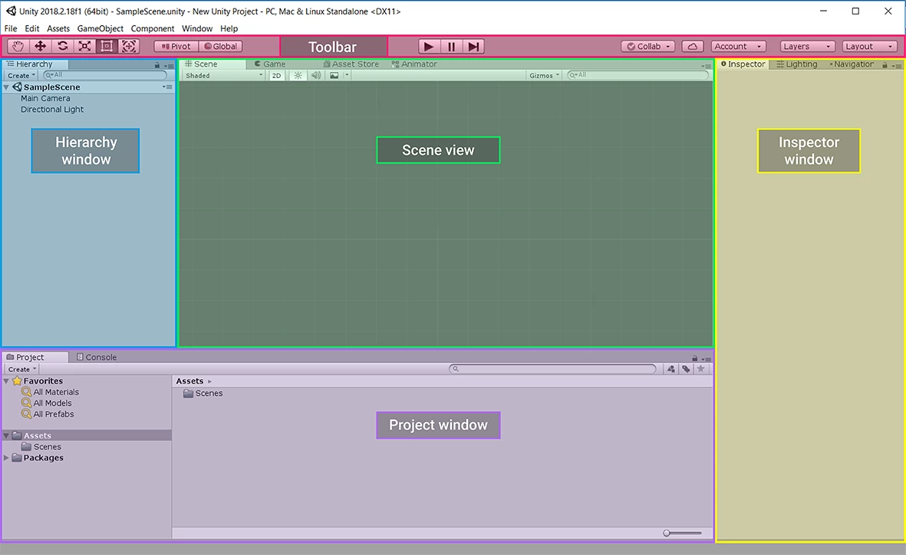
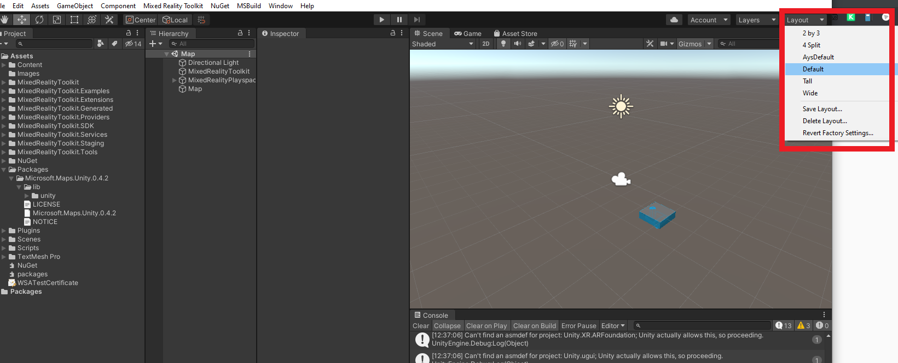
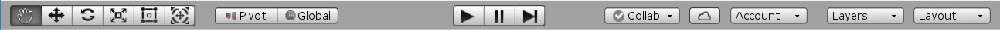
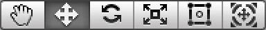
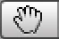
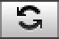
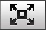
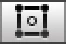
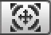
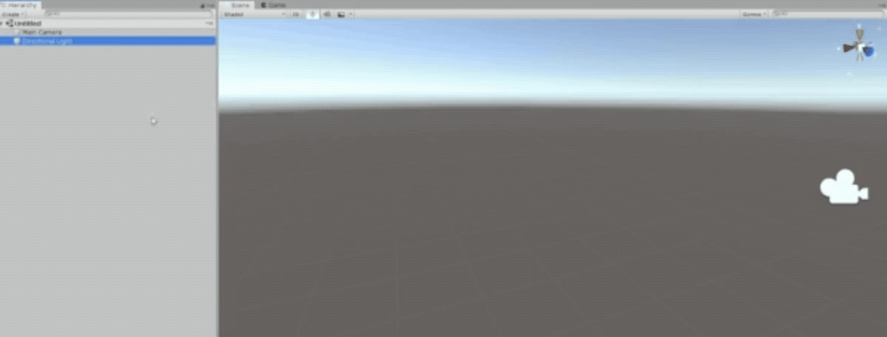

# How to get started with Unity3D Editor interface?

The Unity Editor has **four main sections:**

####  Scene view 

This is where you can edit the current Scene by selecting and moving objects in the 3D space for the game. In this kit, the game level is contained in one Scene.

#### Hierarchy window 

This is a list of all the GameObjects in a Scene. Every object in your game is a GameObject. These can be placed in a parent-child hierarchy, which lets you group objects — this means that when the parent object is moved, all of its children will move at the same time.

#### Inspector window 

This display all settings related to the currently selected object. You will explore this window more during the walkthrough.

#### Project window 

This is where you manage your Project Assets. Assets are the media files used in a Project \(for example, images, 3D models and sound files\). The Project window acts like a file explorer, and it can be used to explore and create folders on your computer. When the walkthrough asks you to find an Asset at a given file path, use this window.

**TIP**: If your Editor layout doesn’t match the image above, use the **layout drop-down** menu at the top right of the toolbar to select **Default**.

## Unity Editor Toolbar

The toolbar includes a range of useful tool buttons to help you design and test your game.

### Play Buttons

#### Play 

Play is used to test the Scene which is currently loaded in the Hierarchy window, and enables you to try out your game live in the Editor. 

#### Pause 

Pause, as you have probably guessed, allows you to pause the game playing in the Game window. This helps you spot visual problems or gameplay issues that you wouldn’t otherwise see.

#### Step 

Step is used to walk through the paused Scene frame by frame. This works really well when you’re looking for live changes in the game world that it would be helpful to see in real time.

### Manipulating objects

These tools move and **manipulate** the **GameObjects** in the **Scene view**. You can click on the buttons to activate them, or use a **shortcut key**.

#### Hand Tool

You can use this tool to move your Scene around in the window. You can also use middle click with the mouse to access the tool.

#### Move Tool

This tool enables you to select items and move them individually.

#### Rotate Tool

Select items and rotate them with this tool.

#### Scale Tool

Tool to scale your GameObjects up and down.

#### Rect Transform Tool

This tool does lots of things. Essentially, it combines moving, scaling and rotation into a single tool that’s specialized for 2D and UI.

#### Rotate, Move or Scale

This tool enables you to **move**, **rotate**, or **scale** GameObjects, but is more specialized for 3D.

### Focusing on GameObject

Another useful shortcut is the **F** key, which enables you to focus on a selected object. If you forget where a GameObject is in your Scene, select it in the Hierarchy. Then, move your cursor over the Scene view and press **F to center** it.

### Navigating with the mouse

When you’re in the Scene view, you can also do the following:

* Left click to select your GameObject in the Scene.
* Middle click and drag to move the Scene view’s camera using the hand tool.

 For more advice on moving GameObjects in the Scene view, see [Scene View Navigation](https://docs.unity3d.com/Manual/SceneViewNavigation.html) in the Manual.  

