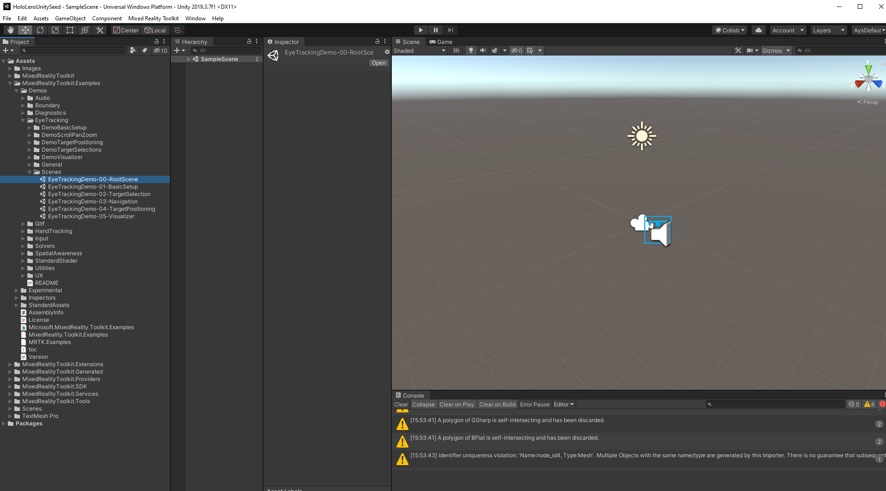

# How to open MRTK example scenes?

* On your **Project panel** select **Assets &gt; MixedRealityToolkit.Examples &gt; Demos.**
* Select from the folders that you want to see an example of, ex: **HandTracking**, **EyeTracking**...
* Open the **Scenes folder** and select a scene and **double click to open.** 
* You can press **play** to try out the scene in your **editor window.**

