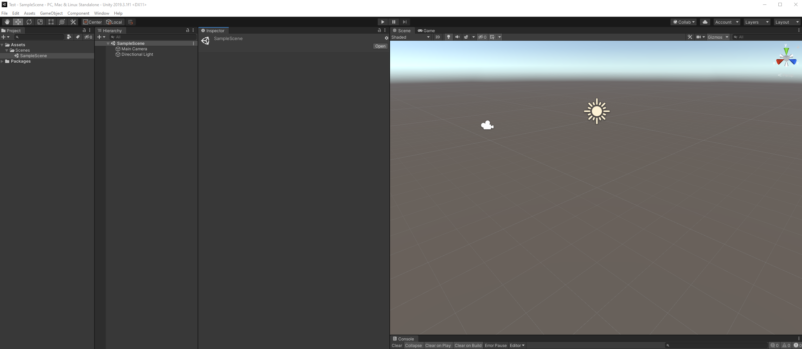

# What are some key concepts for working with Unity?

### Scenes

In Unity, areas of the game that a player can interact with are generally made up of one or more Scenes. Small games may only use one Scene; large ones could have hundreds.

Every Unity project you create comes with a SampleScene that has a light and a camera. 

You can **create a new scene** by right clicking under the assets tab and selecting **Create &gt; Scene**. Organizing scenes under a **Scenes folder** is only for the organization purposes. 

You can use scenes to organize **navigation** inside your application or adding different **levels** to a game.

### GameObjects and components

Every object in the game world exists as a **GameObject** in Unity. GameObjects are given specific features by giving them appropriate **components** which provide a wide range of different functionality. 

When you create a new GameObject, it comes with a Transform component already attached. This component controls the GameObject’s positional properties in the 3D \(or 2D\) gamespace. You need to add all other components manually in the Inspector.

### Prefabs

Prefabs are a great way to configure and store GameObjects for re-use in your game. They act as templates, storing the components and properties of a specific GameObject and enabling you to create multiple instances of it within a Scene.

All copies of the Prefab template in a Scene are linked. This means that if you change the object values for the health potion Prefab, for example, each copy of that Prefab within the Scene will change to match it. However, you can also make specific instances of the GameObject different to the default Prefab settings.

