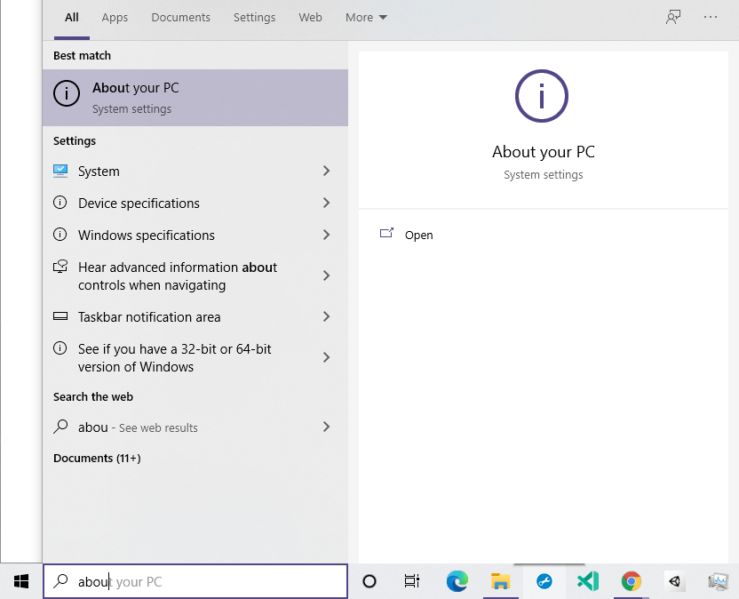
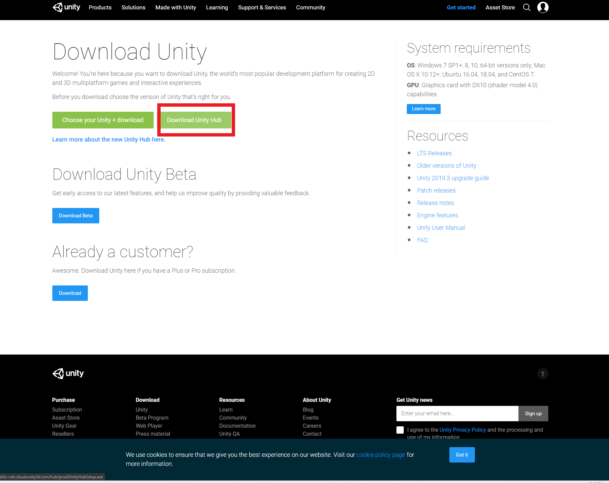
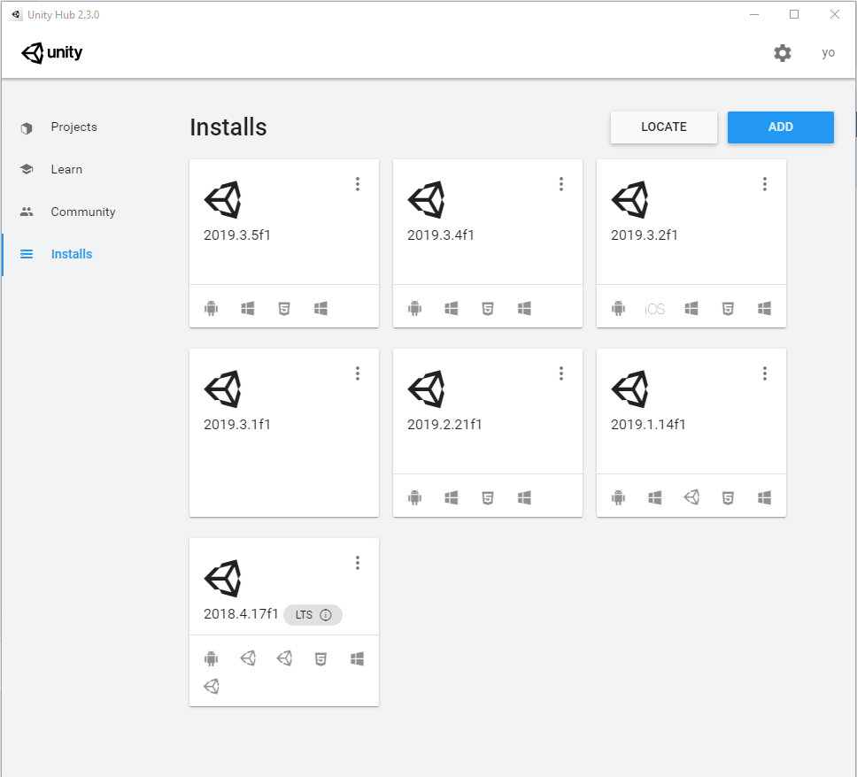
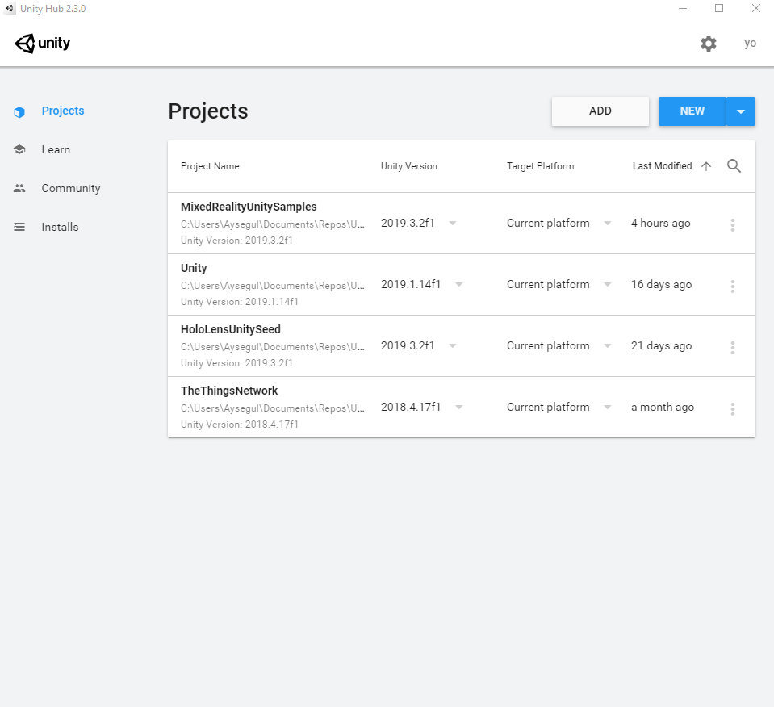
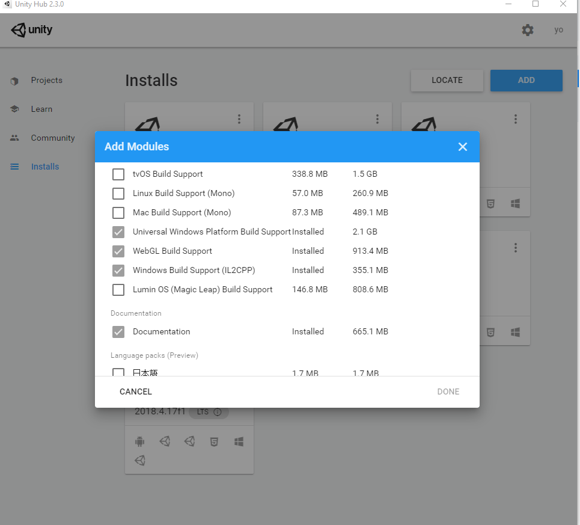
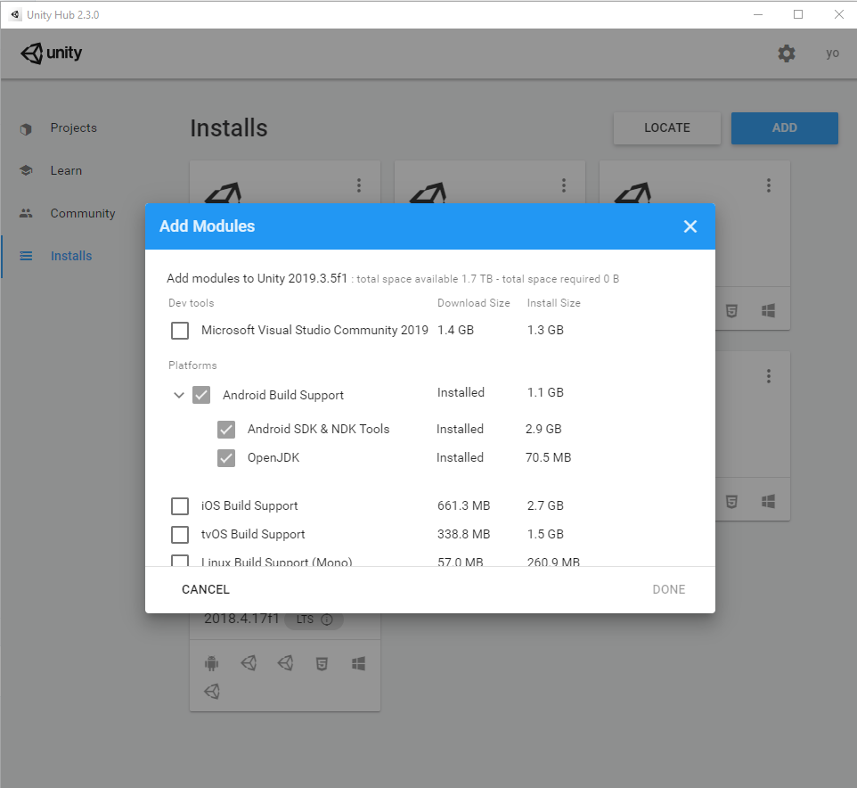
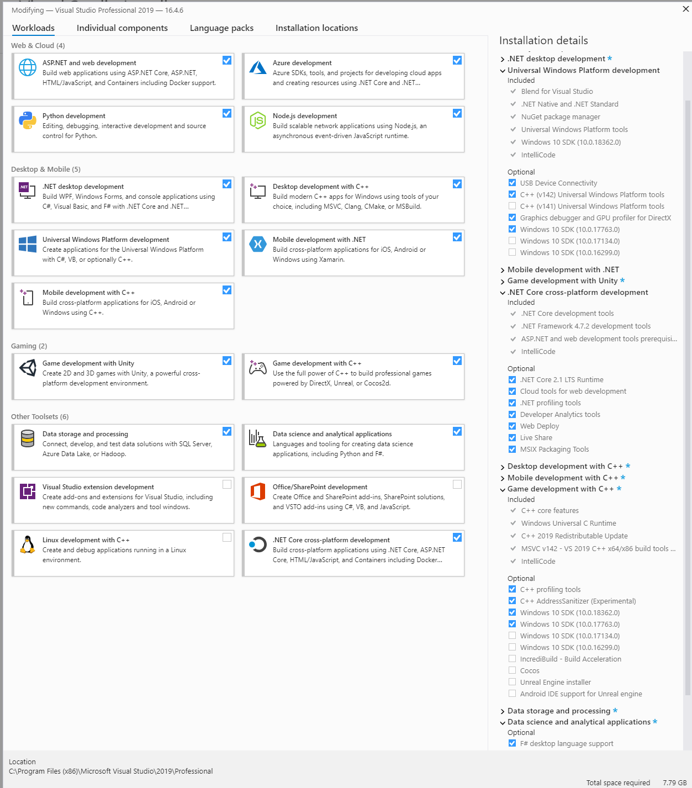
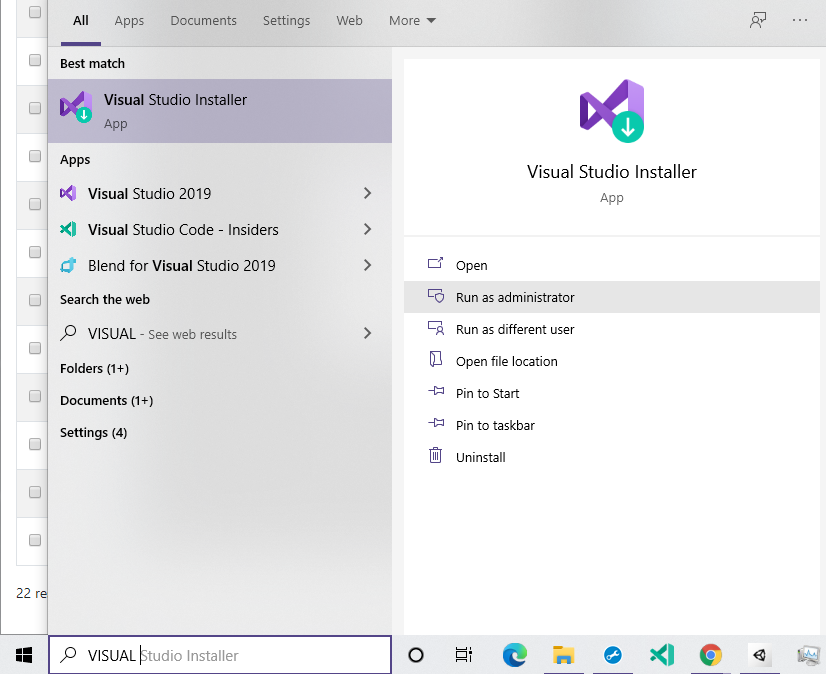
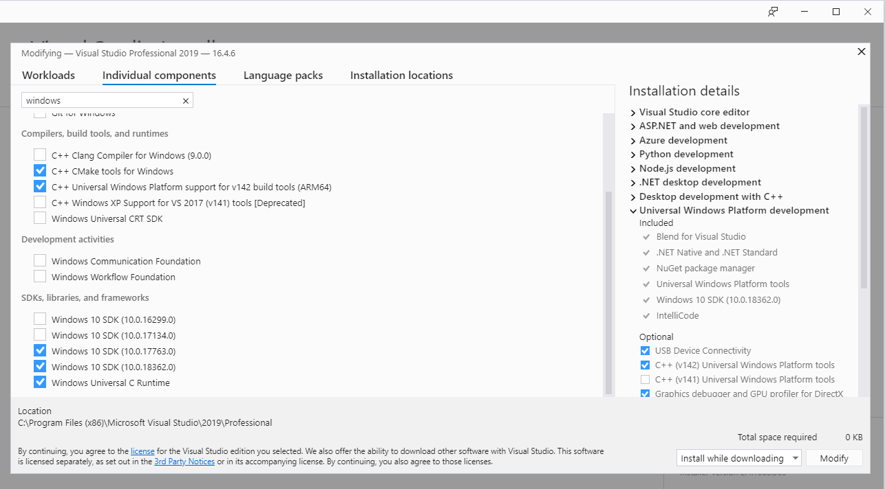

# What do I need to download for Unity Development?

Before you get started with developing for Mixed Reality for Unity, make sure to check everything in the below list and follow the instructions for each download.


 Not following the instructions for specific downloads would result in errors while developing or building your application. Before you try to debug, check the list and detailed instructions.


* [ ] Latest **Windows 10** Education or Pro
* [ ] **Unity** Hub, latest Unity Editor and **Windows modules**. Optionally, iOS or Android modules if you plan to develop for mobile devices. You can always add a module later.
* [ ] **Visual Studio**
* [ ] **Windows 10 SDK**
* [ ] Enable **Hyper-V**
* [ ] Optional: **HoloLens Emulator**

## Windows 10

Install the most recent version of ****[**Windows 10 Education** ](https://aka.ms/Win10ProEducation)or [**Pro Education**](https://aka.ms/VisualStudioWindows) so your PC's operating system matches the platform for which you are building mixed reality applications.

You can check your Windows version by typing "about" in the Windows search bar and selecting **About your PC** as shown in the below image.

 You can learn more about upgrading your Windows 10 Home to Pro at [aka.ms/WinHome2Pro](https://aka.ms/WinHome2Pro).


 We need to install and enable Hyper-V, which **does not work on Windows Home**. Make sure to upgrade to ****_**Education, Pro Education, Pro or Enterprise**_ versions.


## Unity

Go to: [https://unity3d.com/get-unity/download](https://unity3d.com/get-unity/download) page and download the **Unity Hub** instead of Unity Editor. 


**Do not use Beta software** in general before you feel very comfortable with debugging, the software itself and your way around github issues and stackover. Don't learn this lesson the hard way! I have tried that for your benefit and/or my optimism.


**Unity Hub** allows you to download **multiple Unity Editors** and **organize your projects** in one place. Since Unity upgrades are not backward compatible, you have to open the projects with the same Unity version that it was created with. You can update the projects to the latest Unity version but that requires a lot of debugging usually. Easiest way to get going with a project is to keep the same version. I will show you how to debug to update your projects later in this chapter.

You will need to download **Windows development related modules** along with your Unity Editor. Make sure **Universal Windows Platform Build Support** and **Windows Build Support** is checked while downloading Unity Editor through Unity Hub or add it after by modifying the install.

You can add modules or check if you have them in your editor by clicking on the hamburger button for the Unity Editor version and checking the above module check-boxes.

If you would like to build for an Android or iOS mobile device, make sure the related modules are checked as well.

## Visual Studio

You can download Visual Studio by adding **Microsoft Visual Studio 2019** module to your Unity Editor as shown in previous step or download it at [aka.ms/VSDownloads](https://aka.ms/VSDownloads). 


Make sure to download Mixed Reality related modules along with Visual Studio. 


You can always add the necessary workflows to Visual Studio after download:

* [ ] Search for the **Visual Studio Installer** in Windows search bar to open the installer. 

* [ ] Select modify to see the list of modules and select click modify.
* [ ] You can also select the **Windows SDK** versions from individual components tab in the VS installer.

