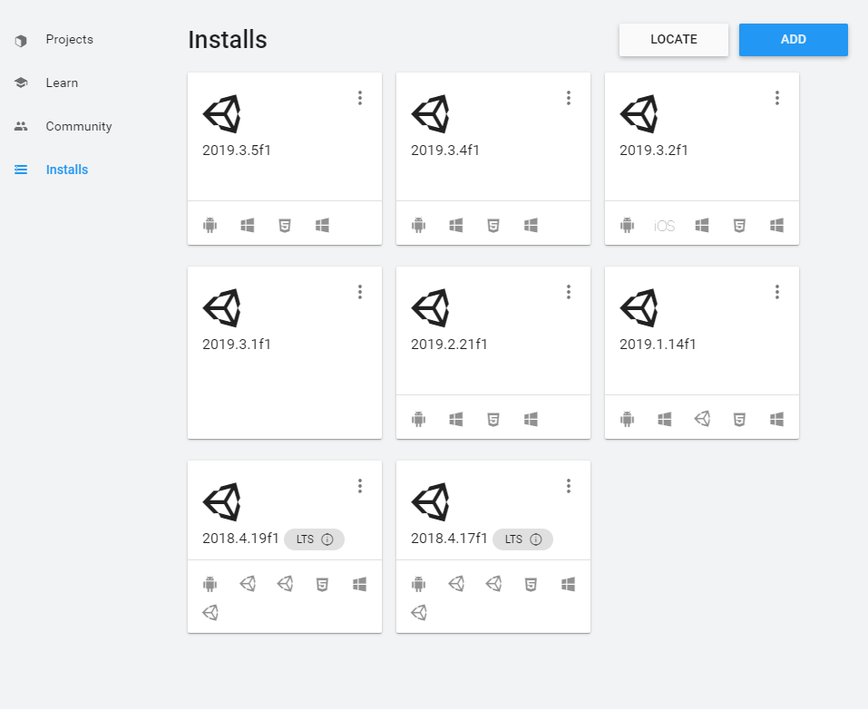

# What could go wrong?

#### What are some of the security issues with Mixed Reality Applications?

Since a Mixed Reality application might have access to the user video stream, developers might be able to  save or share private information about the user. Be mindful of not to save any sensitive data or image anywhere other than users device. Never send sensitive information to any backend. 

#### Why is eye scan data sensitive information?

Iris scan is a more accurate identification method than finger print. Since iris scan data can be used to identify and sing in a user, it should never leave the users device. HoloLens 2 does not send the iris scan to the cloud and does not give access to the data.

#### Why is eye tracking important for users privacy? 

Eye tracking, while a very useful tool to make your application more accessible, it can also be used to collect data about the user's attention and might be used to manipulate the user's attention.

#### Can I open my unity project in the current version, if it is originally saved in an older version?

Unity versions are not backward compatible. If you decide to open a project on a newer version, Unity will try to upd;ate your project automatically but it is not guaranteed that the newer version will work with your imported assets. There might be some incompatibilities with your asset or your code and the new version. 

#### What does the Unity Versioning mean and when is it safe to update the Unity version?

Let's take the latest version in the image below, **2019.3.5f:**

* **2019:** is the year the unity version is developed, changes once a year and there are major changes that will break your application. Stick to the same year version unless you are creating a new application from scratch for now. We will talk about how to update your project to the latest version in the following lessons.
* **3:** implies the 3rd iteration in 2019. When a version updates from 2 to 3, there are minor breaking code. Make sure to read changelog before updating your project from 2 to 3.
* **.5f**: is for bug fixes. Usually there are few fixes that does not break your code or the APIs being used. Feel free to update your project from 2019.3.4f to 2019.3.5f.

### How to update my Unity version to a newer one?

In your Unity Hub, under the project tab, you can select the Unity version drop down for your application and select a newer version of Unity. Unity will confirm your choice before updating your project. It is a good idea to save a version of your project as a new branch in github, in case you need to revert back.

