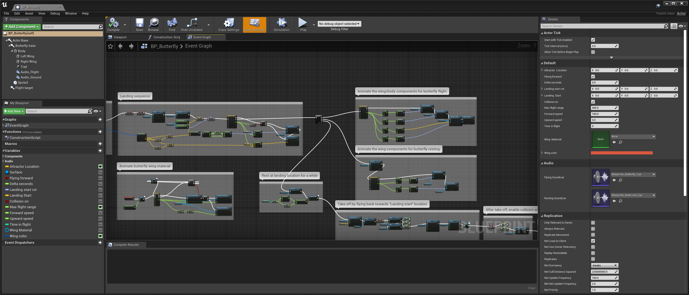

# What are Blueprints?

 The **Blueprints Visual Scripting** system in Unreal Engine is a complete gameplay scripting system based on the concept of using a **node-based** interface to create gameplay elements from within Unreal Editor.

