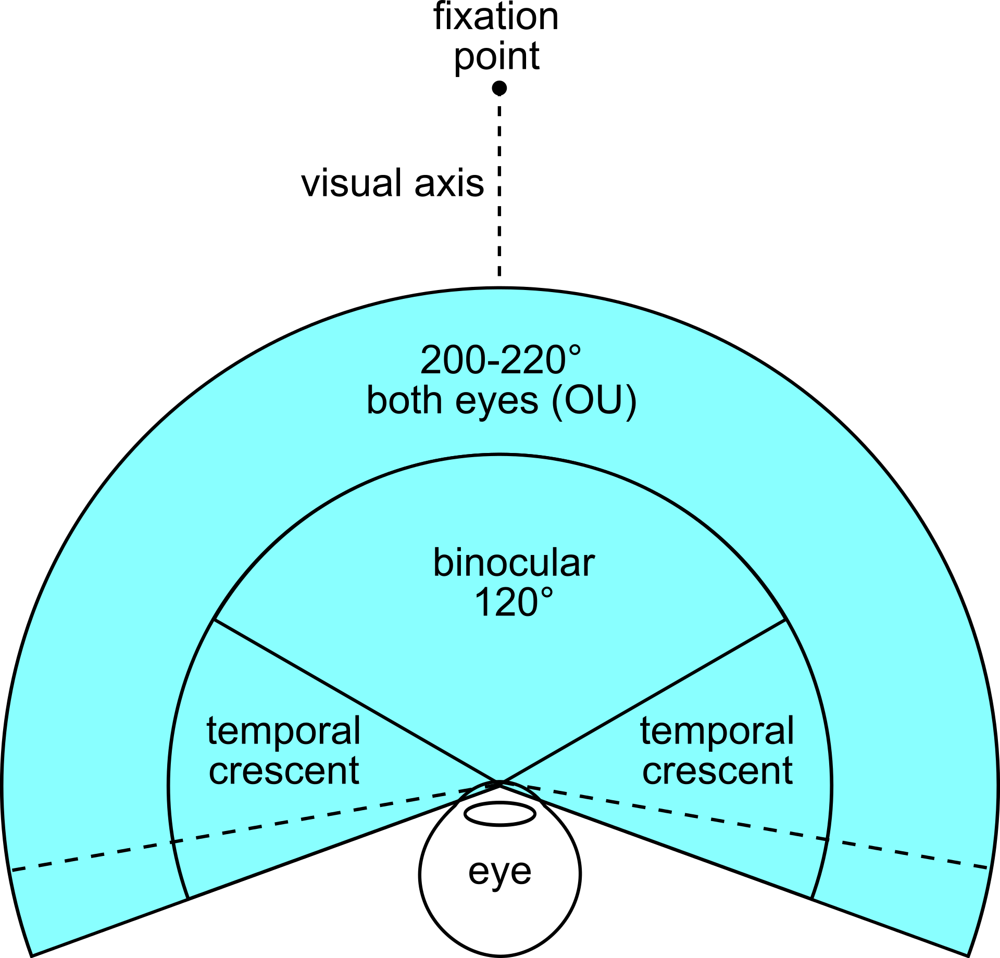

# What is Field of View?

Field of View \(FOV\) is the extent of the scene that is seen on the display at any given moment. The value is in degrees.

Read more on [wikipedia](https://en.wikipedia.org/wiki/Field_of_view).

