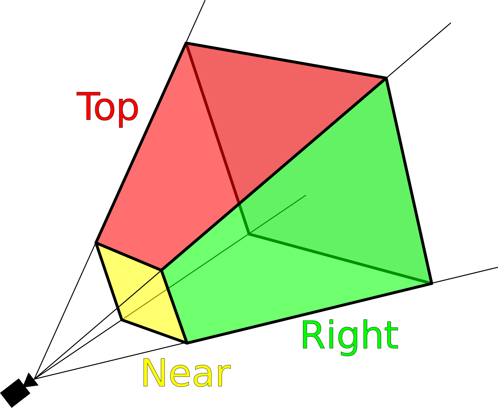

# What is near and far clipping planes of a camera?

Near and far clipping defines the render able area of a scene. Anything before near clipping and after far clipping won't be rendered by your camera, and won't be visible.

