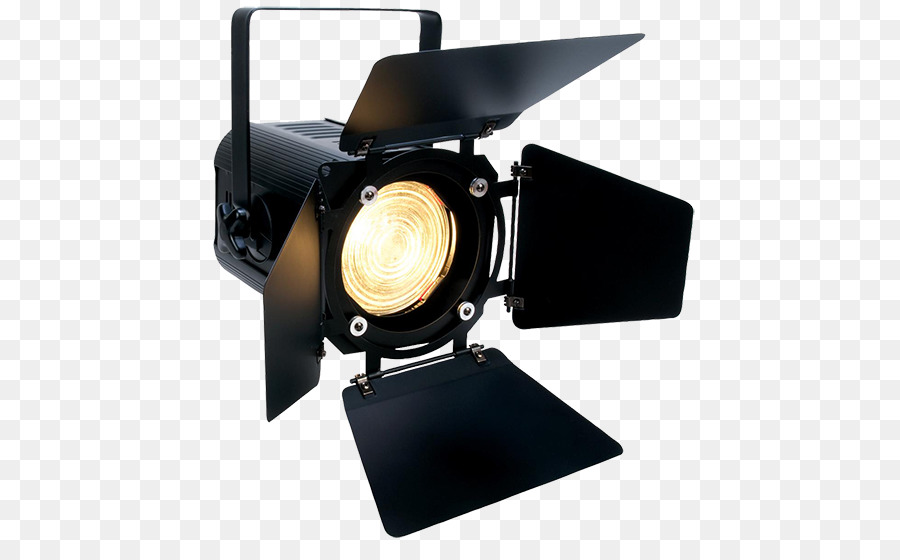
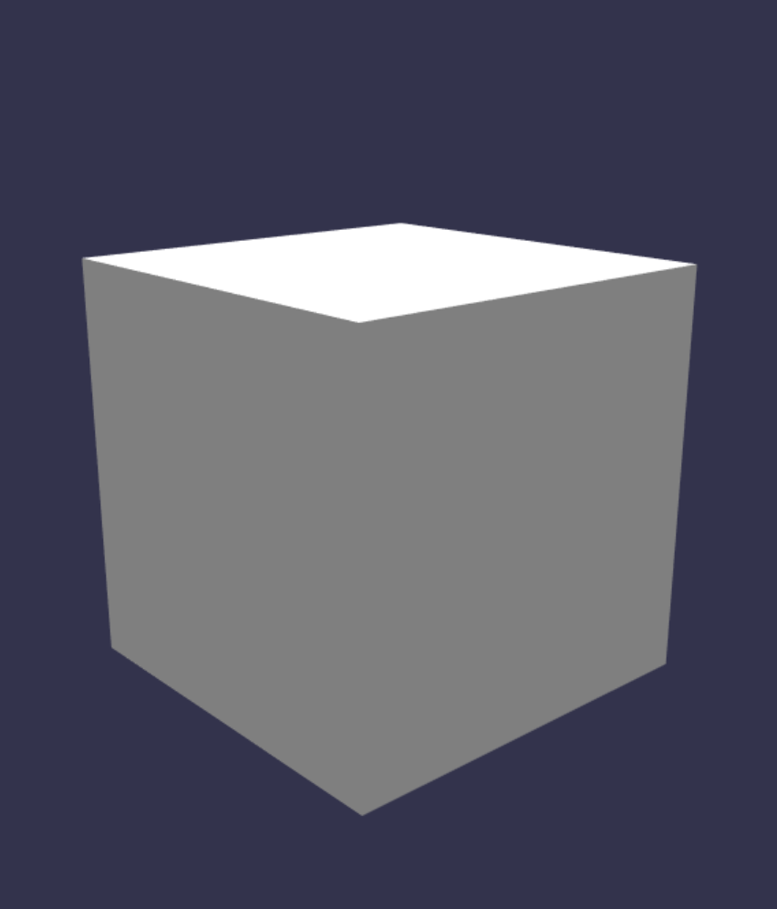
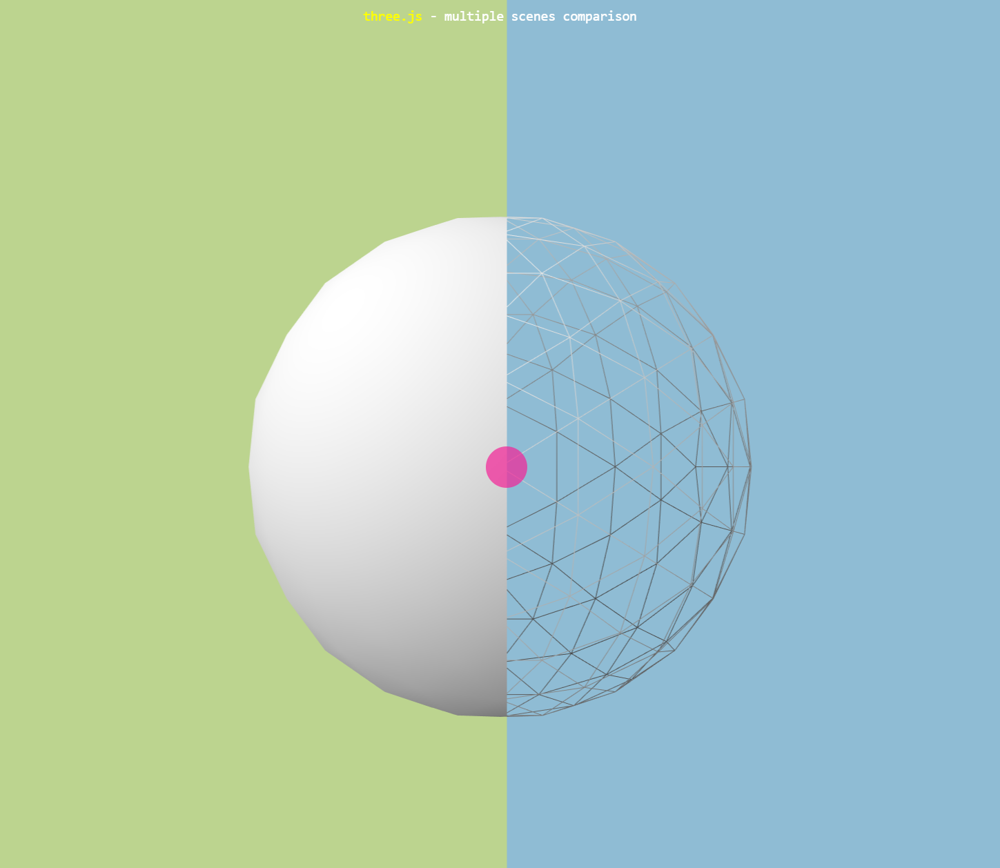

# How to create a basic 3D scene?

To create a basic scene we need to initialize a **scene** object. You can think of a **scene** as a **stage** that will hold your production. Everything that will be visible to the viewer will be added to the scene.

We need to add a **camera** object to the scene that will be our viewers perspective. Anything on the scene but not in the view of the camera won't be visible on your canvas.&#x20;

We also need a **light** source for our objects to be visible.&#x20;

Finally, we will create a basic shape(**mesh**), box.&#x20;


ThreeJS Mesh = material + geometry example


Let's create the basic scene using different libraries.
