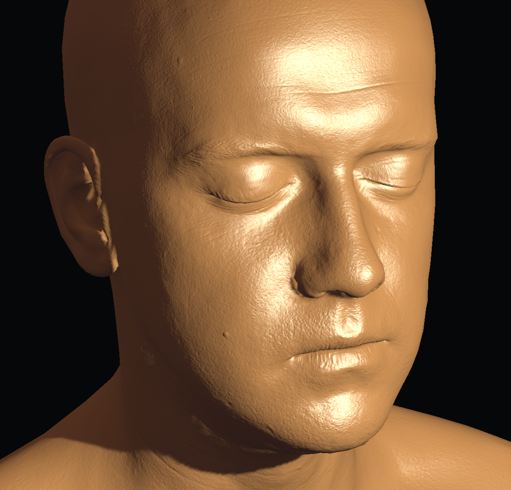

# How to create a globe visualization with ThreeJS

* [ ] Checkout the github repo: [https://github.com/Yonet/WebXRWorkshop](https://github.com/Yonet/WebXRWorkshop)
* [ ] npm install dependencies
* [ ] Add a sphere geometry
* [ ] Add light

```typescript
    //light
    const light = new HemisphereLight(0xffffff, 0xbbbbff, 1);
    light.position.set(0.5, 1, 0.25);
    scene.add(light);
```

### Texture and Bump map

Checkout the example below to see how bump map creates more realistic results.






* [ ] Add Texture Loader and bump and texture maps

```typescript
// Material
const texture = new TextureLoader().load("assets/images/globe/earthmap4k.jpg");
const bumpMap = new TextureLoader().load("assets/images/globe/earthbump4k.jpg");
const material = new MeshPhongMaterial({
    // color: 0xffff00 * Math.random(),
    specular: 0x222222,
    shininess: 25,
    bumpMap: bumpMap,
    bumpScale: 10,
    map: texture,
});
```

### Exercise:

* [ ] Create another sphere slightly bigger than the earth mesh and call it clouds.
* [ ] Assign MeshPhongMaterial and add the properties: {opacity:0.8, transparent: true}
* [ ] Load and assign earhclouds4k.png from the assets folder. Assign the texture as map of clouds material.
* [ ] Set the position of the clouds same as the earth mesh.
* [ ] Add animation slightly faster than earth.

To see how to map real time tweet location data to your globe using web sockets, check out [Tweet Migration project](https://github.com/Yonet/TweetMigration).

