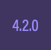

# What is Playground?

Playground is an **online editor** that you can write your code and view the results. 

Few things to note:

* Experimenting and changing any code in the playground and clicking on the **Run** button will **run your code**. Running the code will not affect any original code in the playground you are currently using. Original **code can be restored by refreshing the browser.**
* You need to **save your changes** to create a new version of the the code in Playground. That way, you can share the link with anyone. 

#### Large Screen 

* **Title and Version**: As stated.
* **Language**: Typescript/JavaScript switch.
* **Run** : Commands the playground to try to render your scene.
* **Save** : Causes your scene to be permanently stored in the playground's database and it will issue a unique URL for each save. On save you will be asked to complete the metadata so that it can be searched for. Once saved it is a good idea to bookmark the page so you can return to it later. You could then share the URL with others, for example, if it is not working as you expect you can ask a question in the forum along with the link to your playground.
* **Download** : Allows you to download a zip file named _sample.zip_. Once downloaded and unzipped, you will see a file named `index.html` which contains everything necessary to run the code in your browser, including links to external _babylon.js_ and other files.
* **New** : Places a basic `createScene()` function into the editor along with code to initialise the scene variable and provide a camera.
* **Clear** : Empties all the code out of the playground editor. You could then paste in any createScene function you are working on locally.
* **Settings** : The Settings button has a sub menu with extra options
  * _Theme_: Choose the theme for the playground
  * _Font size_: Set the font size in the editor.
  * _Safe Mode_: When the checkbox is ticked the playground issues a "leaving the page?" confirmation warning when you try to unload/reload a freshly-edited, un-saved scene.
  * _Editor_: The checkbox hides or un-hides the editor portion of the playground.
  * _Full Screen_: Makes the render area full screen.
  * _Editor Full Screen_: Makes the editor area full screen.
  * _Format Code_: Pretty prints the code.
  * _Minimap_: Display the minimap of the code editor.
  * _Inspector_: The checkbox toggles the playground scene inspector which shows a multitude of variable values.
  * _Metadata_: This is where you describe your playground allowing yourself and other to search the playground database for examples of use.
* **Version**  : Allows and shows your choice of the BABYLON.js framework, either the current stable one or the latest preview version.
* **Examples** : A drop down menu giving examples of playgrounds with a search filter.

#### Small Screens 

* **Menu** : Contains Run, New, Clear, Save and Zip as submenus.
* **Code** : Bottom Left Corner - switch to Code View and Editor.
* **Scene** : Bottom Right Corner - switch to Scene View.

