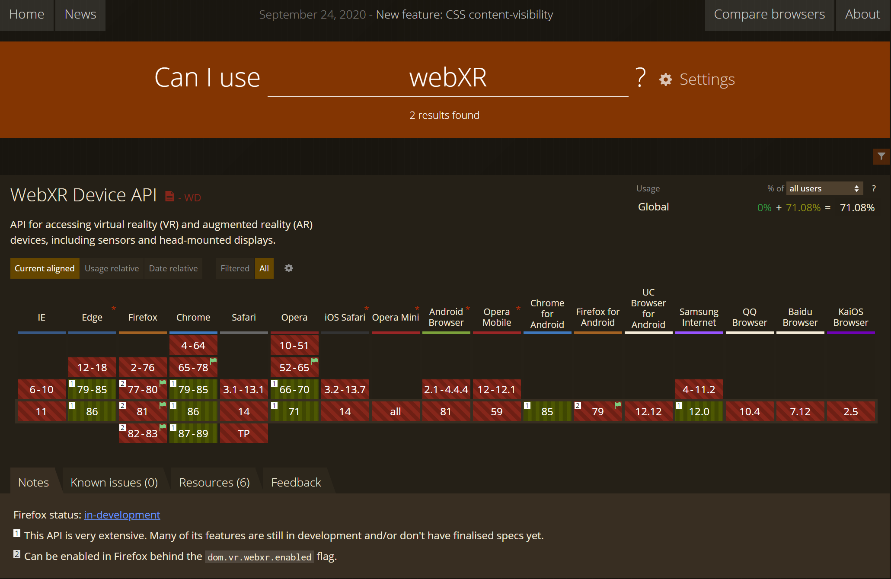

# Which Browsers support WebXR?

Different browsers are implementing and WebXR APIs in different timeframes. Currently Chrome and new Edge browsers have WebXR APIs turned on as default and some of the features are under experimental flags. 

You can check the current support status at [CanIUse.com](https://caniuse.com/?search=webXR).

### How to try out experimental features in Chrome and Edge

You can turn on experimental flags by navigating to **chrome://flags/** or **edge://flags/** and searching for the experimental flag you are looking to enable and choosing **enable** from the drop down menu.

