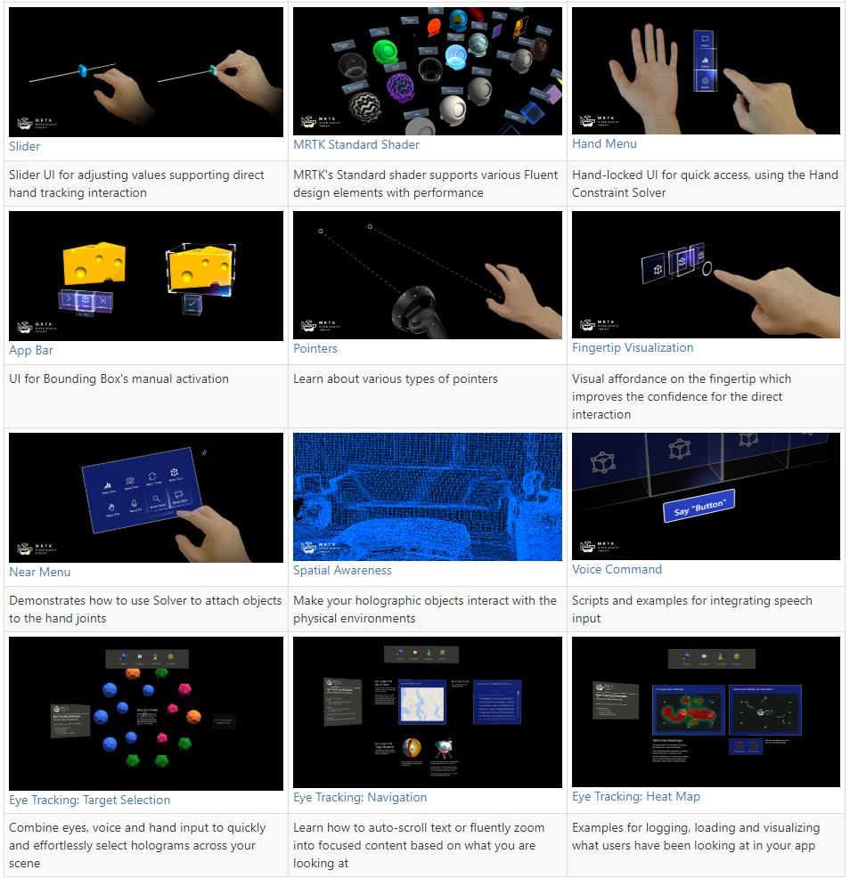
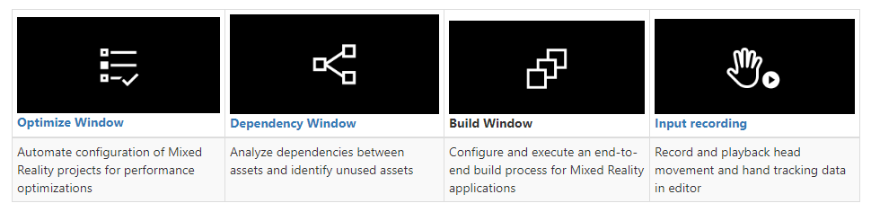
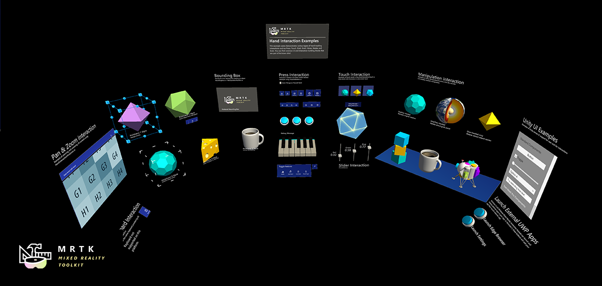
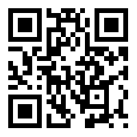

# What is Mixed Reality Toolkit\(MRTK\)?

**Mixed Reality Toolkit \(MRTK\)** provides a set of components and features to accelerate **cross-platform** Mixed Reality application development in **Unity.** MRTK includes:

* **UI and interaction building blocks.**

* **Tools.**

* **Example Scenes.**

You can learn more about the components at: [aka.ms/MRTKGuides](https://aka.ms/MRTKGuides).

