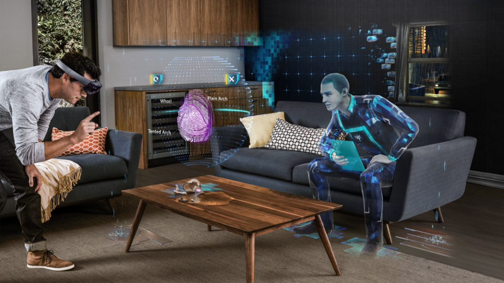

# What is the difference between Augmented Reality, Virtual Reality and Mixed Reality?

[https://youtu.be/gR1KkNuCAxY](https://youtu.be/gR1KkNuCAxY)

**Augmented Reality\(AR\)** is defined as a technology that superimposes a computer-generated image on a user's view of the real world, thus providing a composite view. Augmented Reality experiences are not limited to visual addition to our world. You can create augmented experiences that are only audio addition to your physical world. 

Augmented Reality experiences are also not limited to headsets like HoloLens. Today, millions of mobile devices have depth sensing capabilities to augment your real world with digital information.

**Virtual Reality\(VR\)** is when you are absolutely immersed in a Virtual World by wearing a headset. In Virtual Reality you loose connection to the real world visually. Virtual Reality applications are great for training and simulations where users would benefit from total immersion to replicate the real situation. Some examples would be training for firefighters, Emergency Room healthcare providers and flight simulations.

