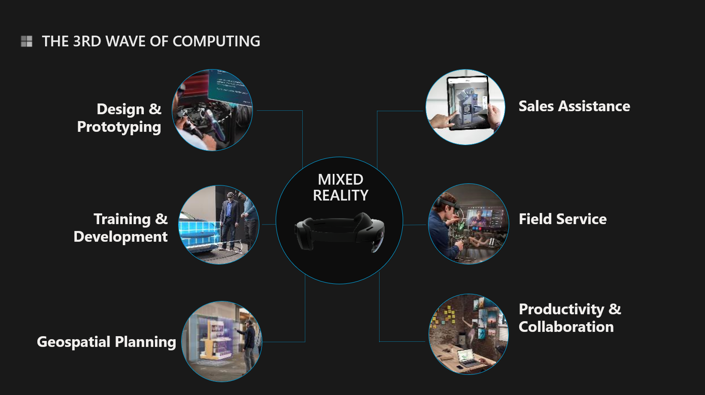

# Why is Mixed Reality important?

First revolution in computing happened with the mainframe computers, that at times occupied a whole room. Mainframes were used by large organizations like Nasa, for critical applications that process data.

Second wave of computing is defined by the Personal Computers\(PC\) being widely available.

We believe third wave of computing is going to include many devices to manage data, including IoT sensors and Mixed Reality devices. 

We have more data than ever before, to be able to process the data and make informed decisions, we need to have access to the data in the right time and right place. Mixed Reality is able to bring that data into our context, real world.

**Design & Prototyping:**  Enables real-time collaborative iteration of 3D physical and virtual models across cross-functional teams and stakeholders.

**Training & Development:** Provides instructors with better tools to facilitate teaching/coaching sessions. Offers trainees more enhanced and engaging learning experiences through 3D visualizations and interactivity.

**Geospatial Planning:**  Enables the assessment and planning of indoor and outdoor environments \(i.e. future construction sites, new store locations, interior designs\), removing the need for manual execution.

Enables the assessment and planning of indoor and outdoor environments \(i.e. future construction sites, new store locations, interior designs\), removing the need for manual execution.

**Sales Assistance:**   Improves the effectiveness of individuals in sales-oriented roles by providing tools such as 3D catalogs and virtual product experiences that increase customer engagement and strengthen buyer confidence

**Field Service:**  Improves the first-visit resolution and customer satisfaction of customer support issues, typically for complex products, that require a field visit.  Can also serve as a platform for targeted up-sell opportunities.

**Productivity & Collaboration:**   Transform the space around you into a shared augmented workplace. Remote users can collaborate, search, brainstorm and share content as if they were in the same room

